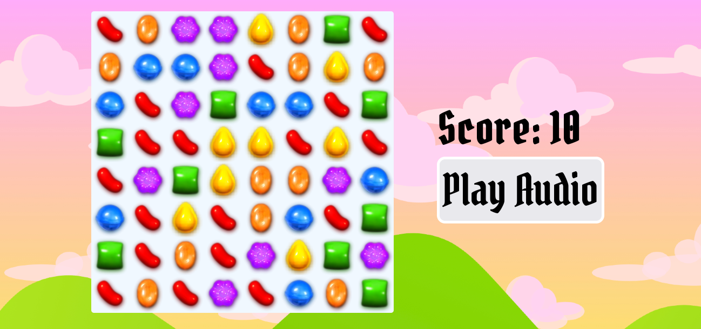

# Candy Crush Game

Welcome to the Candy Crush Game repository! This project is a simplified version of the popular Candy Crush game built using HTML, CSS, and JavaScript.

## How to Play

1. Clone the repository or download the ZIP file.
2. Open `index.html` in your web browser.
3. Swap adjacent candies to create matches of three or more candies of the same color.

## Technologies Used

- HTML
- CSS
- Vanilla JavaScript

**This project was inspired by the Candy Crush game.**
